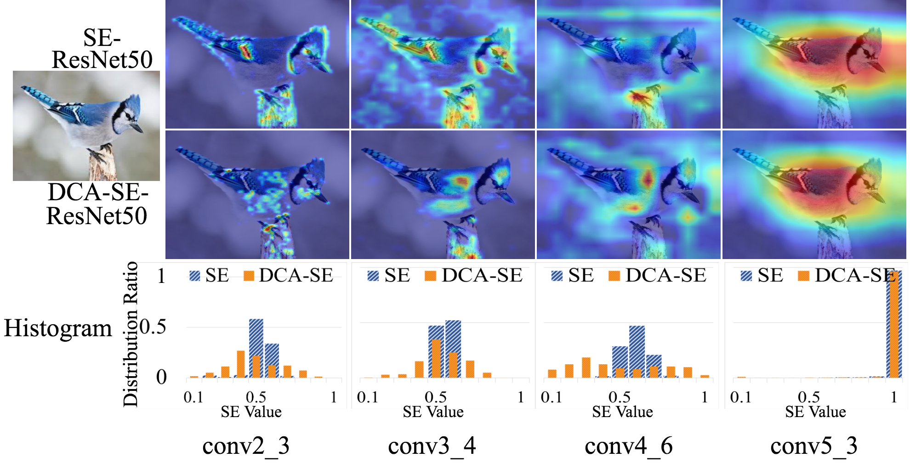
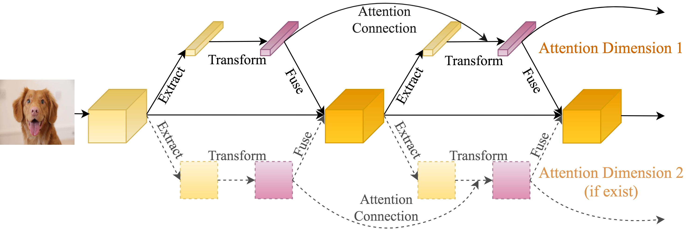

# Deep Connected Attention Networks (DCANet)
By anonymous ECCV 2020 submission. Paper ID: 4574  

## Illustration

  

Figure 1. Illustration of our DCANet. We visualize intermediate feature activation using Grad-CAM. Vanilla SE-ResNet50 varies its focus dramatically at different stages. In contrast, our DCA enhanced SE-ResNet50 **progressively and recursively** adjusts focus, and closely pays attention to the target object.

## Approach

  

Figure 2. **An overview of our Deep Connected Attention Network.** We connect the output of transformation module in the previous attention block to the output of extraction module in current attention block. In the context of multiple attention dimensions, we connect attentions along each dimension. Here we show an example with two attention dimensions. It can be extended to more dimensions.

## Implementation
In this repository, all the models are implemented by [pytorch](https://pytorch.org/).  

We use the standard data augmentation strategies with [ResNet](https://github.com/pytorch/examples/blob/master/imagenet/main.py).  

To reproduce our DCANet work, please refer [Usage.md](Usage.md).

## Trained Models

:blush: `All trained models and training log files are submitted to an anonymous Google Drive.`

:blush: `We provide corresponding links in the "download"  column.`

 
 
Table 1. Single crop classification accuracy (%) on ImageNet validation set. We re-train  models using the PyTorch framework and report results in the "re-implement" column. The corresponding DCANet variants are presented in the "DCANet" column.  The best performances are marked as bold. "-" means no experiments since our DCA module is designed for enhancing attention blocks, which are not existent in base networks.
<table>
<tr align="center">
    <td> </td>
    <td colspan="5"> Re-Implement </td>
    <td colspan="5"> DCANet </td>  
</tr>
<tr align="center">
    <td></td>
    <td>Top1</td>  
    <td>Top5</td>
    <td>Param(G)</td>
    <td>FLOPs</td>
    <td>Download</td>
    <td>Top1</td>  
    <td>Top5</td>
    <td>Param(G)</td>
    <td>FLOPs</td>
    <td>Download</td>
</tr>
<tr align="center">
    <td>ResNet50</td>
    <td>75.90</td>  
    <td>92.72</td>
    <td>4.12</td>
    <td>25.56M</td>
    <td>
        <a href="https://drive.google.com/open?id=1DMHhk99fG8rNZjE2wPh8VWZ5qIBOaYOf">model</a> 
        <a href="https://drive.google.com/open?id=1KOM5BzyxQLZl2Aa5KIVOh6HmE7eQvsKa">log</a> 
    </td>
    <td>-</td>  
    <td>-</td>
    <td>-</td>
    <td>-</td>
    <td>-</td>
</tr>
<tr align="center">
    <td>SE-ResNet50</td>
    <td>77.29</td>  
    <td>93.65</td>
    <td>4.13</td>
    <td>28.09M</td>
    <td>
        <a href="https://drive.google.com/open?id=1lOXZv0IskrLLbm_z7JqonR6KaQ7lRpKP">model</a> 
        <a href="https://drive.google.com/open?id=1gl43ufL2Pvum-dZy8B4yAnnV3bl1BSi2">log</a> 
    </td>
  <td><b>77.64</b></td>  
    <td>93.74</td>
    <td>4.13</td>
    <td>30.90M</td>
    <td>
        <a href="https://drive.google.com/open?id=1du9DiFiinqrkbx2Nlkhtb1CkIBSTsWZT">model</a> 
        <a href="https://drive.google.com/open?id=10zWHU5kQj7F-ecAH-YrY_hNjHWJPPPDm">log</a> 
    </td>
</tr>
<tr align="center">
    <td>SK-ResNet50</td>
    <td>77.79</td>  
    <td>93.76</td>
    <td>5.98</td>
    <td>37.12M</td>
    <td>
        <a href="https://drive.google.com/open?id=1jwQ-us0G0LSesHGZwmDgjL1W5O7Ekyu6">model</a> 
        <a href="https://drive.google.com/open?id=1DGMM9c1Vfo_YniYTUeL-jfAmsQuwhJYX">log</a> 
    </td>
    <td><b>77.94</b></td>  
    <td>93.90</td>
    <td>5.98</td>
    <td>37.48M</td>
    <td>
        <a href="https://drive.google.com/open?id=1KTtC8Ht73Qp8cExV6hIP5S-3i7O2WQzf">model</a> 
        <a href="https://drive.google.com/open?id=1-hcNbNUlPOHS2vSpvlOb43WtYaIE8RTs">log</a> 
    </td>
</tr>
<tr align="center">
    <td>GEθ-ResNet50</td>
    <td>76.24</td>  
    <td>92.98</td>
    <td>4.13</td>
    <td>25.56M</td>
    <td>
        <a href="https://drive.google.com/open?id=1N-UVJhZDkoHnxzhE0p_VRsCgGDExi0iA">model</a> 
        <a href="https://drive.google.com/open?id=1KcPMHcDfcgu87TAHqy3ovNN29pIZdkPi">log</a> 
    </td>
    <td><b>76.60</b></td>  
    <td>93.26</td>
    <td>4.13</td>
    <td>28.37M</td>
    <td>
        <a href="https://drive.google.com/open?id=149oExXCLMOtWlWwn53AE69lv5WrB7DG4">model</a> 
        <a href="https://drive.google.com/open?id=1FYxCI7p3A64ZoRbEWeLAA_E6_Sq_BsRu">log</a> 
    </td>
</tr>
<tr align="center">
    <td>GC-ResNet50</td>
    <td>74.90</td>  
    <td>92.28</td>
    <td>4.13</td>
    <td>28.11M</td>
    <td>
        <a href="https://drive.google.com/open?id=1GGe9UzVFjMpoRkQVf3td5BrLeb1ZfwVM">model</a> 
        <a href="https://drive.google.com/open?id=1iE8m0MgK8Ek7ui5UxF8s0w8tZ8XG8dyN">log</a> 
    </td>
    <td><b>75.42</b></td>  
    <td>92.47</td>
    <td>4.13</td>
    <td>28.63M</td>
    <td>
        <a href="https://drive.google.com/open?id=1BOE3aMD_ump8c0GeAOv7aZgub5ce_3c7">model</a> 
        <a href="https://drive.google.com/open?id=1Ozn8AdYqvWi3teyZBU_p_FsGWjPAp8Pt">log</a> 
    </td>
</tr>
<tr align="center">
    <td>CBAM-ResNet50</td>
    <td>77.28</td>  
    <td>93.60</td>
    <td>4.14</td>
    <td>28.09M</td>
    <td>
        <a href="https://drive.google.com/open?id=1brCXiQ0LNbqVejQMrY0eVmcwZSGhYFN3">model</a> 
        <a href="https://drive.google.com/open?id=1MVBSKLSu9lyxNKrxH4WoA4fHsE86y45K">log</a> 
    </td>
    <td><b>77.83</b></td>  
    <td>93.72</td>
    <td>4.14</td>
    <td>30.90M</td>
    <td>
        <a href="https://drive.google.com/open?id=1XsqSTBRG-YcG-5_n74nDMrG0aoDpgt0D">model</a> 
        <a href="https://drive.google.com/open?id=1QVivbUHbVLqmDGj-UmNwp5M8Izl2jXrq">log</a> 
    </td>
</tr>
<tr align="center">
    <td>Mnas1_0</td>
    <td>71.72</td>  
    <td>90.32</td>
    <td>0.33</td>
    <td>4.38</td>
    <td>
        <a href="https://drive.google.com/open?id=1UKr08-7ZCH8h8Purkij9j9lqnxBAzOw6">model</a> 
        <a href="https://drive.google.com/open?id=1dIeVjvMjI7vUHaiGAy_hlwSL6Nag7DSp">log</a> 
    </td>
    <td>-</td>  
    <td>-</td>
    <td>-</td>
    <td>-</td>
    <td>-</td>
</tr>
<tr align="center">
    <td>SE-Mnas1_0</td>
    <td>69.69</td>  
    <td>89.12</td>
    <td>0.33</td>
    <td>4.42M</td>
    <td>
        <a href="https://drive.google.com/open?id=1f3xWWXSYL2IjH5Tif8H2BA3LaJ4pk1dH">model</a> 
        <a href="https://drive.google.com/open?id=1UyxmWYEnoRQc4p4djlF3MCPEVrxfEQtj">log</a> 
    </td>
  <td><b>71.76</b></td>  
    <td>90.40</td>
    <td>0.33</td>
    <td>4.48M</td>
    <td>
        <a href="https://drive.google.com/open?id=1cUeylsXhG5kjBHsypJgdsra3WZLRL1HP">model</a> 
        <a href="https://drive.google.com/open?id=1Y_qG474k-dnX0pHnwj0gsJIILRlR0uC6">log</a> 
    </td>
</tr>
<tr align="center">
    <td>GEθ-Mnas1_0</td>
    <td>72.72</td>  
    <td>90.87</td>
    <td>0.33</td>
    <td>4.38M</td>
    <td>
        <a href="https://drive.google.com/open?id=1AcEdumcdVEeyYGOwSeJuEUIC0c3m0O8H">model</a> 
        <a href="https://drive.google.com/open?id=13Y1jSy5KTF-VbAEfqsJ4BivpsLtLQ0ch">log</a> 
    </td>
    <td><b>72.82</b></td>  
    <td>91.18</td>
    <td>0.33</td>
    <td>4.48M</td>
    <td>
        <a href="https://drive.google.com/open?id=16xRtAaSVUTH7XQvRVUVe-YZsiQCsfsW3">model</a> 
        <a href="https://drive.google.com/open?id=1Xg5MudQlAWm5iRRRqQqHoQmIV6j2ZLjO">log</a> 
    </td>
</tr>
<tr align="center">
    <td>CBAM-Mnas1_0</td>
    <td>69.13</td>  
    <td>88.92</td>
    <td>0.33</td>
    <td>4.42M</td>
    <td>
        <a href="https://drive.google.com/open?id=1soKKwkg8lvlC_vQ9dZ1MRk7TxQQFdKO2">model</a> 
        <a href="https://drive.google.com/open?id=1JFSLAotSu8ZN18PCBMQKmYKmySZcE4Ci">log</a> 
    </td>
    <td><b>71.00</b></td>  
    <td>89.78</td>
    <td>0.33</td>
    <td>4.56M</td>
    <td>
        <a href="https://drive.google.com/open?id=1gmp8YsNToWG4_fEZahDtnayD7uFWnhQ-">model</a> 
        <a href="https://drive.google.com/open?id=1tLxA7GjICeWuDwNuhf4e9KtwreFJTmA7">log</a> 
    </td>
</tr>
<tr align="center">
    <td>MobileNetV2</td>
    <td>71.03</td>  
    <td>90.07</td>
    <td>0.32</td>
    <td>3.50M</td>
    <td>
        <a href="https://drive.google.com/open?id=1amJcumWN7rCXo8tmVT5Ndc3YacbVuZ8-">model</a> 
        <a href="https://drive.google.com/open?id=1rHcRDyVY-sFlSwi3_9kJvKeUsrXFrMNR">log</a> 
    </td>
    <td>-</td>  
    <td>-</td>
    <td>-</td>
    <td>-</td>
    <td>-</td>
</tr>
<tr align="center">
    <td>SE-MobileNetV2</td>
    <td>72.05</td>  
    <td>90.58</td>
    <td>0.32</td>
    <td>3.56M</td>
    <td>
        <a href="https://drive.google.com/open?id=1w5345bSQ8m_6XVg9S6sONm3jh6IDzCy9">model</a> 
        <a href="https://drive.google.com/open?id=1_phgf_OrqfB8UJqMSA1okH8QvtO1n9qS">log</a>       
    </td>
    <td><b>73.24</b></td>  
    <td>91.14</td>
    <td>0.32</td>
    <td>3.65M</td>
    <td>
        <a href="https://drive.google.com/open?id=1FfCigzz9D3tS5W5fTKvV0ibwGKzWj37r">model</a> 
        <a href="https://drive.google.com/open?id=1wrkeY9m8rHEs_GAXmb7GlpTmMBFwRkLc">log</a> 
    </td>
</tr>
<tr align="center">
    <td>SK-MobileNetV2</td>
    <td>74.05</td>  
    <td>91.85</td>
    <td>0.35</td>
    <td>5.28M</td>
    <td>
        <a href="https://drive.google.com/open?id=1S5EZ8WvGipOz8ARIeVbNAdEBl-MjZICB">model</a> 
        <a href="https://drive.google.com/open?id=1-3A9l1T7lZ-PQhrZG58DOA-xA4Tla-kg">log</a> 
    </td>
    <td><b>74.45</b></td>  
    <td>91.85</td>
    <td>0.36</td>
    <td>5.91M</td>
    <td>
        <a href="https://drive.google.com/open?id=1F9uL7iSjRikXuNRjwfxZPBpZ9tgUxFy0">model</a> 
        <a href="https://drive.google.com/open?id=1_bESxWT6XZCGmFbVZwks1nT4Wuehjq2a">log</a> 
    </td>
</tr>
<tr align="center">
    <td>GEθ-MobileNetV2</td>
    <td>72.28</td>  
    <td>90.91</td>
    <td>0.32</td>
    <td>3.50M</td>
    <td>
        <a href="https://drive.google.com/open?id=1ftjknhcucW1tmbUuW-u0NewxVwsWuopD">model</a> 
        <a href="https://drive.google.com/open?id=1f-o23z434xWkZOgkCIo_HQYSiqHq4od3">log</a> 
    </td>
    <td><b>72.47</b></td>  
    <td>90.68</td>
    <td>0.32</td>
    <td>3.59M</td>
    <td>
        <a href="https://drive.google.com/open?id=1BfA6YjGUEGz7Gv5hVVgYQksFQf0xZdQh">model</a> 
        <a href="https://drive.google.com/open?id=1Ih8q0te7XeBLm-JAcmOmNHwVmf98Xuy0">log</a> 
    </td>
</tr>
<tr align="center">
    <td>CBAM-MobileNetV2</td>
    <td>71.91</td>  
    <td>90.51</td>
    <td>0.32</td>
    <td>3.57M</td>
    <td>
        <a href="https://drive.google.com/open?id=1DtOCk4GMJ4TuFgSO2D_u5a25u2OSQGU6">model</a> 
        <a href="https://drive.google.com/open?id=1RGkqogGgMrgP7EeW2gFYQRqUZyDoGu4d">log</a> 
    </td>
    <td><b>73.04</b></td>  
    <td>91.18</td>
    <td>0.34</td>
    <td>3.65M</td>
    <td>
        <a href="https://drive.google.com/open?id=1KNajLHuOezvMZBPCU5xZzAY5rafh7SwG">model</a> 
        <a href="https://drive.google.com/open?id=15W66XRigFgfT0w0tH1aEOn7q37PnzZIu">log</a> 
    </td>
</tr>
</table>

 
 
Table 2: Detection performances (%) with different backbones on the MS-COCO validation dataset. We employ two state-of-the-art detectors: RetinaNet and Cascade R-CNN  in our detection experiments.

| Detector | Backbone | AP(50:95) | AP(50) | AP(75) | AP(s)|AP(m)|AP(l)|Download
|:-:|:-:|:-:|:-:|:-:|:-:|:-:|:-:|:-:|
|Retina|ResNet50|36.2|55.9|38.5|19.4|39.8|48.3|[model](https://drive.google.com/open?id=1imZvUrwg6Vy6TFRLAsL62FsF-DyizZXR) [log](https://drive.google.com/open?id=14rRmHai_9ghL5oC-1DTTiLrt4w_HY0Yl)
|Retina|SE-ResNet50|37.4|57.8|39.8|20.6|40.8|50.3|[model](https://drive.google.com/open?id=1ivzPfC_JhpO7DPs6vzlHGxkZBf2sC60p) [log](https://drive.google.com/open?id=1mKctgPjf9QbEXTeSm_-J_kqeiVNGuMT7)
|Retina|DCA-SE-ResNet50|**37.7**|**58.2**|**40.1**|**20.8**|**40.9**|**50.4**|[model](https://drive.google.com/open?id=18RMzZOCWlALy1_H_Fzgwt9mAxWSU7TYj) [log](https://drive.google.com/open?id=14Sd5OQ4P8okI-Z63avm09HaA4NNQfTxs)
Cascade R-CNN|ResNet50|40.6|58.9|44.2|22.4|43.7|**54.7**|[model](https://drive.google.com/open?id=1jGUT2KsFggLSJMkH0cgJUJV_p_cSM-7f) [log](https://drive.google.com/open?id=13g-4XlMlySVUJyrvWeU5FVCA--cojaCk)
Cascade R-CNN|GC-ResNet50|41.1|59.7|44.6|**23.6**|44.1|54.3|[model](https://drive.google.com/open?id=19cv3TReITDMJuvmAleGzzt3H39iq3pYl) [log](https://drive.google.com/open?id=1uCcKukd4HKtxIc1uUfKydd-_NIPnj9_i)
Cascade R-CNN|DCA-GC-ResNet50|**41.4**|**60.2**|**44.7**|22.8|**45.0**|54.2|[model](https://drive.google.com/open?id=1JRmfIg-8Ia0GdMripIHZUVwwPM1hDu6F) [log](https://drive.google.com/open?id=1bbM9Fq2MhrmClcZ-EncniI4nqcGuLEPF)
